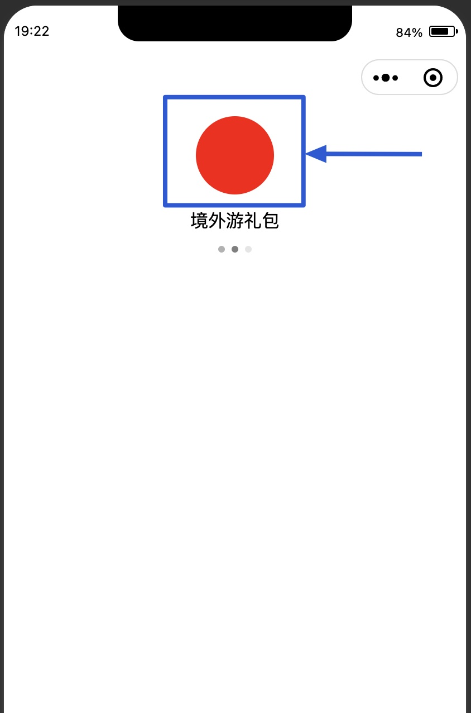
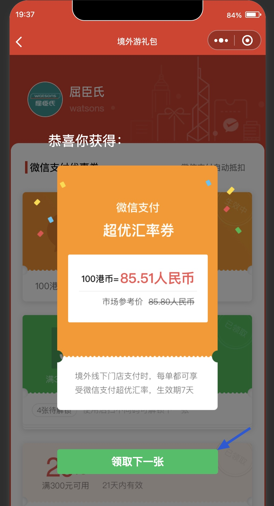
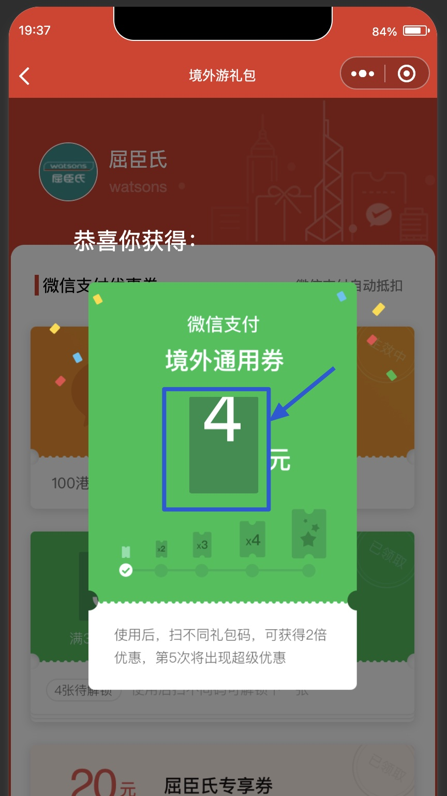
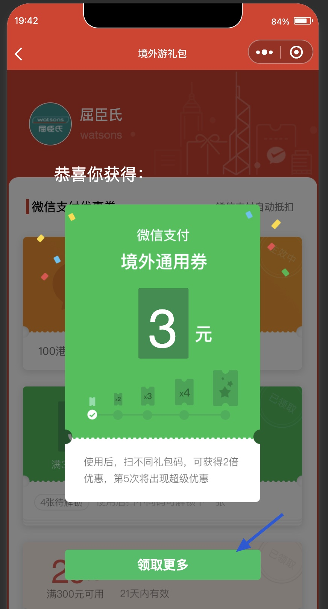
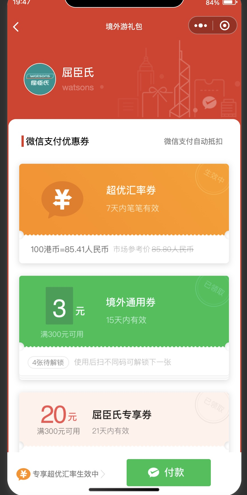

# 作者：陆天承
## 2021年5月3日（美国时间）
## 实现方式：微信小程序
## 调试基础库：2.16.1
### 运行流程

#### 第一步：
运行小程序后，会显示如下界面，此时点击蓝色框内的红色头像可进入下一界面。

#### 第二步：
进入主界面后，会自动展示一个弹窗，点击蓝色箭头所指的按钮则会关闭当前弹窗并打开下一个弹窗。此处有一个我不清楚原因的小问题：我设置了打开弹窗时禁止背景页面的滚动功能，但是这个功能在微信开发者工具的模拟器中不能正常起作用，只有在真机预览才有效。

#### 第三步：
下一个弹窗打开后，在图中蓝框内会有一个类似老虎机轮盘的动画效果，在动画结束前不会显示下一步的按钮。

#### 第四步：
轮盘动画结束，显示最终结果，此时下一步按钮也出现。点击蓝色箭头所指按钮关闭弹窗，进入下一步。

#### 第五步：
关闭弹窗后，正式进入主界面，主界面底部有固定的自定义tabbar。

# P.S.
当我拿到设计稿时，我发现这是专为微信小程序设计的，如果使用之前在电脑端开发前端的方法，很可能吃力不讨好，而且不符合需求。所以，尽管这是我第一次使用微信小程序开发软件进行相关开发，我还是选择了小程序这个载体。在整个小程序开发过程中，我能体会到的是微信确实很有野心，整个开发系统已经自成一派并且很容易上手。

由于我在过去的一周刚好毕业，琐事繁多，所以很抱歉没有更多精力投入到这个小测试中。因而很多情况下，我都选择了插入image这样较简单的解决方案，实在是没有办法，不好意思。同时由于我之前未曾使用过sketch，所以我提取出的某些素材很可能不太专业、美观，也在此提前说声抱歉。

希望您五一过的还算开心。
